# Proxi

Proxmox, Terraform og Ansible til et K3s-cluster – fra nul til kørende cluster på få minutter.

---

## Hvad bygger vi?

Et **K3s Kubernetes-cluster** med 1 control plane og 2 workers, kørende som virtuelle maskiner på **Proxmox**. Alt er beskrevet som kode: VM’erne oprettes med **Terraform**, og **Ansible** installerer K3s, joiner workers og sætter ingress + MetalLB op. Når du vil starte forfra: `terraform destroy` → `terraform apply` → kør Ansible igen → rent cluster.

```mermaid
flowchart LR
  subgraph Proxmox["🖥️ Proxmox VE"]
    CP["k3s-cp-1"]
    W1["k3s-worker-1"]
    W2["k3s-worker-2"]
  end

  subgraph K3s["☸️ K3s cluster"]
    CP --> API["API server"]
    W1 --> API
    W2 --> API
  end

  Terraform["📜 Terraform"] -.->|opretter| Proxmox
  Ansible["⚙️ Ansible"] -.->|konfigurerer| Proxmox
```

---

## Hvem gør hvad?

| Software | Ansvar | Kort sagt |
|--------|--------|------------|
| **Proxmox VE** | Virtualisering | Kører på din server. Opretter og kører VM’er, netværk, disk. Du logger ind i et **webbrugergrænseflade** (https://ip:8006) og kan se/køre/stoppe VM’er, templates, storage. |
| **Terraform** | Infrastruktur som kode | Læser `main.tf` og taler med Proxmox via **API**. Siger: "Jeg vil have 3 VM’er, klonet fra denne template, med disse specs." Opretter/opdaterer/sletter VM’er – ikke software inde i VM’erne. |
| **Ansible** | Konfiguration som kode | Logger ind på VM’erne via **SSH** og kører tasks (pakker, scripts, filer). Siger: "På disse hosts: installer K3s, join til cluster, installer ingress." Ansible ved ikke hvem der lavede VM’erne – den bruger bare et **inventar** (liste af hosts + IP). |

```mermaid
flowchart TB
  subgraph Du["Du"]
    TF_code["main.tf"]
    ANS_code["playbooks/*.yml"]
  end

  subgraph Terraform_flow["Terraform-flow"]
    TF_code --> TF_cli["terraform apply"]
    TF_cli --> Proxmox_API["Proxmox API (HTTPS)"]
    Proxmox_API --> VMs["VM’er på Proxmox"]
  end

  subgraph Ansible_flow["Ansible-flow"]
    ANS_code --> ANS_cli["ansible-playbook"]
    ANS_cli --> SSH["SSH til VM’er"]
    SSH --> Software["K3s, ingress, MetalLB"]
  end

  VMs --> SSH
```

---

## Interfaces du bør kende

- **Proxmox Web UI**  
  `https://<din-proxmox-ip>:8006` – log ind, se nodes, VM’er, storage (fx **Disks**), netværk (fx **TRUNK**). Her opretter du også **templates** (fx Ubuntu med cloud-init) én gang manuelt.

- **Proxmox API**  
  Samme server, `https://<ip>:8006/api2/json`. Terraform (via bpg-provider) bruger den med et **API-token** (bruger + token-id + secret). Du behøver normalt ikke kalde API’en direkte.

- **SSH til VM’er**  
  Efter Terraform har startet VM’erne: `ssh ubuntu@<vm-ip>` med din nøgle. Ansible bruger præcis det til at køre playbooks. IP får du fra `terraform output` (når guest agent har meldt ind) eller fra Proxmox UI / DHCP.

- **Kubernetes (K3s)**  
  Når Ansible er færdig: `kubectl` mod control plane (K3s laver en kubeconfig). Det er **dit** interface til at deploye apps, se pods, ingress, osv.

```mermaid
sequenceDiagram
  participant Du
  participant Terraform
  participant Proxmox
  participant VMs
  participant Ansible
  participant K3s

  Du->>Terraform: terraform apply
  Terraform->>Proxmox: API: clone template → 3 VM’er
  Proxmox->>VMs: VM’er kører (DHCP, cloud-init)

  Du->>Ansible: ansible-playbook k3s.yml
  Ansible->>VMs: SSH: installer K3s, join, ingress, MetalLB
  VMs->>K3s: K3s cluster kører

  Du->>K3s: kubectl / dashboards
```

---

## Hvad kan du selv?

- **Terraform:** Ændre `main.tf` (flere workers, anden VMID, andet storage, andre variabler) → `terraform plan` / `apply`. Rydde alt: `terraform destroy`.
- **Ansible:** Ændre playbooks og inventar → kør playbooks igen. Tilføje roller, tasks, variabler.
- **Proxmox:** Lave nye templates, tilføje storage, netværk, backup – eller lade Terraform styre VM’erne og bruge UI’en til at **se** og evt. starte/stoppe.
- **K3s:** Når clusteret kører: `kubectl apply -f ...`, helm, ingress-routes, MetalLB – alt det du vil bygge oven på Kubernetes.

```mermaid
flowchart LR
  subgraph Gentagelsesloop["♻️ Gentagelsesloop"]
    A["terraform destroy"] --> B["terraform apply"]
    B --> C["ansible-playbook k3s.yml"]
    C --> D["Rent K3s-cluster"]
    D -.->|"vil du starte forfra?"| A
  end
```

---

## Mapper i repo’et

- **`TerraForm/`** – `main.tf`, variabler, readme. Proxmox VM’er (1 control plane + 2 workers).
- **`Ansible/`** – inventar, playbooks (fx K3s), `ansible.cfg`. Konfiguration inde i VM’er.

Hvis du vil have flere Mermaid-diagrammer (fx netværk, dataflow til MetalLB), sig til.
